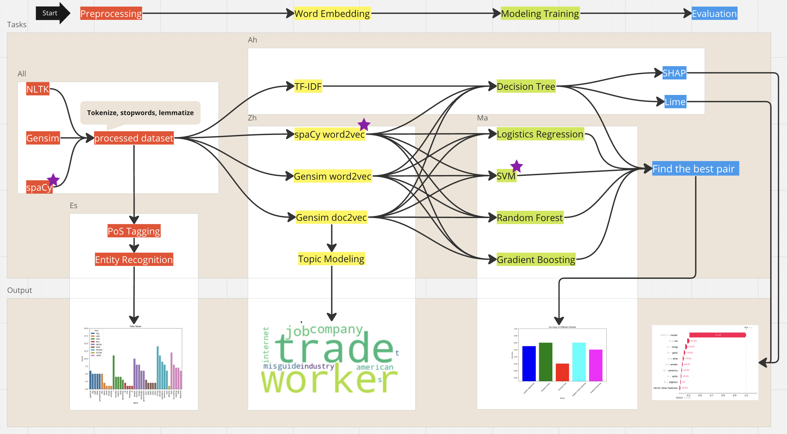

# Machine Learning Approaches for Distinguishing Real from Fake: A Study on Fake News Classification with NLP Techniques

## Abstract
1-2 paragraphs of 200–250 words. Should concisely state the problem, why it is important, and give some indication of what you accomplished (2-3 discoveries)

Traditional methods of identifying and combating fake news are often insufficient due to the sheer volume and speed at which it is disseminated. Leveraging machine learning (ML) techniques offers a promising solution to this problem. ML models can be trained to detect patterns and features indicative of fake news, such as linguistic cues, source credibility, and dissemination patterns. By automating the detection process, ML can quickly and efficiently analyze vast amounts of data, far beyond the capacity of human fact-checkers.

Our main objective is to identify a pair of high-accuracy vectorizer and classifier that can effectively recognize fake news. To achieve this, we compared popular libraries such as NLTK, spaCy, and Gensim for text preprocessing and vectorization, resulting in three different vectors. We then trained models using six different classifiers, creating a total of 18 combinations. From these, we selected the combination with the highest accuracy score as our output.

Our secondary objective involves using spaCy and Gensim for entity recognition and topic modeling during text preprocessing to perform basic semantic analysis. Additionally, considering the interpretability challenges of the Word2Vec model, we used the TF-IDF model as a baseline. We employed SHAP and LIME to interpret feature importance, identifying the key terms that significantly influence the classifier.

## Introduction
State your data and research question(s). Indicate why it is important. Describe your research plan so that readers can easily follow your thought process and the flow of the report. Please also include key results at the beginning so that readers know to look for. Here you can very briefly mention any important data cleaning or preparation. Do not talk about virtual results i.e. things you tried or wanted to do but didn’t do. Virtual results are worse than worthless. They highlight failure.

The terms "fake news" and "misinformation" have seen a massive uptick in use within the past couple of years. The phenomenon of false information being spread throughout many forms of media (particularly the Internet) has caused concern for its impacts on health and wellness safety, political distrust, social divisiveness, and a decrese in 

## Background
Discuss other relevant work on solving this problem. Most of your references are here. Cite all sources. There is no specific formatting requirement for citations but be consistent.

## Data
Where you go the data. Describe the variables. You can begin discussing the data wrangling, and data cleaning. Some EDA may happen here. This includes your data source (including URL if applicable), any articles behind the data source.

## Methods
How did you take your data and set up the problem? Describe things like normalization, feature selection, the models you chose. In this section, you may have EDA and graphs showing the exploration of hyper-parameters. Note: Use graphs to illustrate interesting relationships that are important to your final analyses. DO NOT just show a bunch of graphs because you can. You should label and discuss every graph you include. There is no required number to include. The graphs should help us understand your analysis process and illuminate key features of the data.

  Our main goal was to build the best Machine Learning classifier that can accurately classify the data, which consists of news documents as real or fake. The process was quite challenging as we are dealing with complex text data. Inorder to accomplish this goal, our tasks were mainly focused on Data cleaning and Exploration, Text preprocessing using various NLP libraries, Feature extraction and building word vectors, Model building, training, and testing, Model Evaluation and Model Explainability.

  After loading the data and initial analysis of the data using basic pandas dataframe inspection methods along with missingno library plots, we found that the data is clean with no null values as well as the classes are balance with 23481 Fake and 21417 Real news data. Therefore, we decided to start with Exploratory Data Analysis. But for this step, we need to clean and tokenzie the text documents using NLP libraries. We used nltk, Genism as well as Spacy libraries for text preprocessing and cleaning. Now, the data is cleaned and tokenized, we applied various visualization techniques to understand the distribution of data. To understand the distribution of most frequent words in both classes, we created a wordcloud along with Frequency bar charts of words. But the results indicated that almost all words occured equally in both classes. Therefore, we decided to move on with utilizing Spacy's entity recognition method. The results were interesting in the fact that the Fake news data comprised of few interjections which included profanities which were abscent in True news data. 

## Evaluation
Here will to show your different models’ performance. It is particularly useful to show multiple metrics and things like ROC curves (for binary classifiers). Make sure it is clearly not just what the score is but for which instances in the data one has the largest errors (in a regression), or just sample examples miss-classified. Make an attempt to interpret the parameters of the model to understand what was useful about the input data. Method comparison and sensitivity analyses are absolutely CRUCIAL to good scientific work. To that end, you MUST compare at least 2 different methods from class in answering your scientific questions. It is important to report what you tried but do so SUCCINCTLY.

## Conclusion
Summarize how well your solution works Characterize how robust you think the results are (did you have enough data?) Try for interpretation of what the model found (what variables were useful, what was not)? Try to avoid describing what you would do if you had more time. If you have to make a statement about “future work” limit it to one short statement.

## Attribution
Using the number and size of GitHub commits by author (bar graph), and the git hub visualizations of when the commits occurred. Using these measures each person should self-report how many code-hours of their work are visible in the repo with 2-3 sentences listing their contribution. Do not report any code hours that cannot be traced to commits. If you spend hours on a 2-line change of code or side-reading you did, you cannot report. If you do searches or research for the project that does not result in code, you must create notes in a markdown file (eg. in the project wiki) and the notes should be commensurate with the amount of work reported. Notes cannot be simply copy-pasted from elsewhere (obviously).

## Bibliography
References should appear at the end of the report/notebook. Again, no specific format is required but be consistent.

## Appendix
If there are minor results and graphs that you think should be included, put them at the end. Do not include anything without an explanation. No random graphs just for padding!! However, let’s say you did a 50 state analysis of poverty and demographics, and your report focused on the 5 most interesting states, for completeness you could include all in an appendix. Be sure though to provide some (very short) discussion with each figure/code/result.
