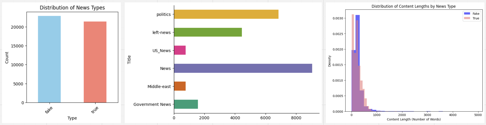

# Machine Learning Approaches for Distinguishing Real from Fake: A Study on Fake News Classification with NLP Techniques

## Abstract
1-2 paragraphs of 200–250 words. Should concisely state the problem, why it is important, and give some indication of what you accomplished (2-3 discoveries)

Traditional methods of identifying and combating fake news are often insufficient due to the sheer volume and speed at which it is disseminated. Leveraging machine learning (ML) techniques offers a promising solution to this problem. ML models can be trained to detect patterns and features indicative of fake news, such as linguistic cues, source credibility, and dissemination patterns. By automating the detection process, ML can quickly and efficiently analyze vast amounts of data, far beyond the capacity of human fact-checkers.

Our main objective is to identify a pair of high-accuracy vectorizer and classifier that can effectively recognize fake news. To achieve this, we compared popular libraries such as NLTK, spaCy, and Gensim for text preprocessing and vectorization, resulting in three different vectors. We then trained models using six different classifiers, creating a total of 18 combinations. From these, we selected the combination with the highest accuracy score as our output.

Our secondary objective involves using spaCy and Gensim for entity recognition and topic modeling during text preprocessing to perform basic semantic analysis. Additionally, considering the interpretability challenges of the Word2Vec model, we used the TF-IDF model as a baseline. We employed SHAP and LIME to interpret feature importance, identifying the key terms that significantly influence the classifier.

## Introduction
State your data and research question(s). Indicate why it is important. Describe your research plan so that readers can easily follow your thought process and the flow of the report. Please also include key results at the beginning so that readers know to look for. Here you can very briefly mention any important data cleaning or preparation. Do not talk about virtual results i.e. things you tried or wanted to do but didn’t do. Virtual results are worse than worthless. They highlight failure.

The terms "fake news" and "misinformation" have seen a massive uptick in use within the past couple of years. The phenomenon of false information being spread throughout many forms of media (particularly the Internet) has caused concern for its impacts on health and wellness safety, political distrust, and social divisiveness. This, coupled with a growing epidemic of decreasing attention spans highlights the need for a fast and accurate way to detect fake news in order to avoid it or mitigate it's spread.

The dataset, obtained from Kaggle, focuses on real and fake news and includes four features: news title, news content, news category, and creation date. The labels are "true" and "fake." The goal of our research project is to extract data features using NLP techniques and then combine them with ML to find an effective classifier, which we will validate using recent real and fake news.

To achieve this, we broke down the research project into core issues:

- Vectorization is a key challenge. The dataset consists of 40,000 rows, with each row's news content averaging 300 tokens. Extracting features from such a large dataset is problematic. The traditional models we are familiar with, such as BoW and TF-IDF, are only effective for small datasets. For the larger dataset, we used Word2Vec and Doc2Vec.

- Choosing the classifier. We used logistic regression as a baseline and experimented with Decision Tree, SVM, and ensemble algorithms like Random Forest and Gradient Boosting. Although we did not explore every possible model, we refrain from concluding that we used the best models. Nevertheless, the selected models achieved an accuracy of approximately 90%.

- Interpreting the results is challenging. Text analysis is notoriously difficult to interpret, especially after word embedding when all words are vectorized. Determining which words significantly impact the label is challenging. Therefore, we used SHAP and LIME methods to interpret the results.

Our team's main workflow is illustrated in the diagram below:

## Background
Discuss other relevant work on solving this problem. Most of your references are here. Cite all sources. There is no specific formatting requirement for citations but be consistent.

Our dataset is a labeled NLP problem. Therefore, the main focus is on NLP and ML. NLP is the challenging part, requiring us to review extensive Python documentation and perform comparative testing. We have consulted numerous sources, including:  
[Nltk API](https://www.nltk.org/)  
[spaCy API](https://spacy.io/api)  
[Gensim API](https://radimrehurek.com/gensim/apiref.html#api-reference)  
[Textblob](https://textblob.readthedocs.io/en/dev/)  
[FastText](https://fasttext.cc/)  
[BERT Tutorial](https://huggingface.co/blog/bert-101)  

Additionally, we researched SHAP/LIME to improve the interpretability of our results.  
[SHAP](https://shap.readthedocs.io/en/latest/)  
[LIME](https://github.com/marcotcr/lime)  

## Data
Where you go the data. Describe the variables. You can begin discussing the data wrangling, and data cleaning. Some EDA may happen here. This includes your data source (including URL if applicable), any articles behind the data source.

[Data Source](https://www.kaggle.com/datasets/emineyetm/fake-news-detection-datasets?resource=download) is from Kaggle. The dataset contains two types of articles: fake and real News. This dataset was collected from real world sources; the truthful articles were obtained by crawling articles from Reuters.com (News website). As for the fake news articles, they were collected from different sources. The fake news articles were collected from unreliable websites that were flagged by Politifact (a fact-checking organization in the USA) and Wikipedia. The dataset contains different types of articles on different topics, however, the majority of articles focus on political and World news topics.
The dataset consists of two CSV files. The first file named “True.csv” contains more than 12,600 articles from reuter.com. The second file named “Fake.csv” contains more than 12,600 articles from different fake news outlet resources. Each article contains the following information: article title, text, type and the date the article was published on. To match the fake news data collected for kaggle.com, we focused mostly on collecting articles from 2016 to 2017. The data collected were cleaned and processed, however, the punctuations and mistakes that existed in the fake news were kept in the text.

Sample Data: 

| title                 | text                                             | subject      | date       | type |
| --------------------- | ------------------------------------------------ | ------------ | ---------- | ---- |
| As U.S. budget...     | The head of a conservative Republican faction... | politicsNews | 12/31/2017 | TRUE |
| Donald Trump Sends... | He had to give a shout out to his enemies...     | News         | 12/31/2017 | FAKE |

After data preprocessing, we can observe some data features:
- In terms of the amount of labels, our dataset is a very balanced one.
- The content length for both true and fake news are 300 tokens on average.
- The null value takes up 1%, which should be dropped instead of imputation.
- The news fall into 6 categories.
- We will only take column 'text' and 'type' into the NLP. 

## Methods
How did you take your data and set up the problem? Describe things like normalization, feature selection, the models you chose. In this section, you may have EDA and graphs showing the exploration of hyper-parameters. Note: Use graphs to illustrate interesting relationships that are important to your final analyses. DO NOT just show a bunch of graphs because you can. You should label and discuss every graph you include. There is no required number to include. The graphs should help us understand your analysis process and illuminate key features of the data.

  Our main goal was to build the best Machine Learning classifier that can accurately classify the data, which consists of news documents as real or fake. The process was quite challenging as we are dealing with complex text data. Inorder to accomplish this goal, our tasks were mainly focused on Data cleaning and Exploration, Text preprocessing using various NLP libraries, Feature extraction and building word vectors, Model building, training, and testing, Model Evaluation and Model Explainability.

  After loading the data and initial analysis of the data using basic pandas dataframe inspection methods along with missingno library plots, we found that the data is clean with no null values as well as the classes are balance with 23481 Fake and 21417 Real news data. Therefore, we decided to start with Exploratory Data Analysis. But for this step, we need to clean and tokenzie the text documents using NLP libraries. We used nltk, Genism as well as Spacy libraries for text preprocessing and cleaning. Now, the data is cleaned and tokenized, we applied various visualization techniques to understand the distribution of data. To understand the distribution of most frequent words in both classes, we created a wordcloud along with Frequency bar charts of words. But the results indicated that almost all words occured equally in both classes. Therefore, we decided to move on with utilizing Spacy's entity recognition method. The results were interesting in the fact that the Fake news data comprised of few interjections which included profanities which were absent in True news data. 

**Word Embedding.**   
We tried three vectorization models, including tf-idf, word2vec and doc2vec.   
	- tf-idf is highly interpretable and good for small dataset. we use sklearn api.   
	- Word2vec takes the word orders into consideration, measures the similarity of words and runs fast for large dataset due to lower dimensionality. We tried both spaCy and gensim api.  
	- Doc2vec takes the whole content into analysis, finds similarity between contents and fits the content into a fixed-length vector, especially good for topic modeling. We tried gensim api.  

However, unlike tf-idf, the word2vec and doc2vec are not as easy to interprete and evaluate. The accuracy is highly related to the quality of corpora. In order to remove the bias of corpora and run it faster, we make use of spaCy and gensim pre-trained models. These models are well trained with wide-topic and super large dataset.   
	- spacy/en_core_web_sm  
	- gensim/word2vec-google-news-300  
 
In this step, we performed feature extraction with different models and get a number of large matrice below as input for the machine learning models:  
	- LDA-matrix, generated by gensim word2vec  
 	- BoW-matrix, generated by spaCy plus nltk  
  	- W2V-matrix, generated by spaCy word2vec  
   	- D2V-matrix, generated by gensim doc2vec  

**Model Training**  
For this binary classification, we tried multiple models, from weak learners to ensemble methods. Train models along with above 4 matrice as input. There are expected 4*5 pairs. We will loop over all combinations to find the best combined.   
	- Logistics Regression(lr). Set as baseline model.  
	- Decision Tree(dt).  
	- Support Vector Machine(svm).   
	- Random Forest(rf).  
	- Gradient Boosting(gb).  

 **Model Explainability**
 

	 we used three different methods of model explainability:
1. plot_tree function of decision tree to visualize the performance of the model as well as to identify the important features. 

	 The above tree visualization of the classifier indicates that the classifier uses 'said' feature as one of the main feature to decide whether the text is fake or real. In the next level, 'minist' and 'via' are used to split the data into the respective classes based on certain threshold values for the features.

	 The bar chart on the feature importance also indicates that the 'said' and 'via' features have substantial significance in influencing the model decision compared to other features. 

2. SHAP will is used for both global and local interpretability, and is well suited for complex tasks to provide a list of feature contributions.  It shows the class prediction score for each feature and the final class is selected based on the majority score. The class 1 indcates that it is real and 0 indicates that it is fake. 

From the waterfall plot above, an idea on the features that the model relies on class prediction is evident. The 6th indexed test data shows that the features 'said','via', and 'washington' predicts the data as real. These are some of the important features whose prediction score is used by the model for prediction.

 The above summary plot picturizes how the model works in a global scale. It shows that 'said' and 'via' are two important word features that the model heavily relies on deciding which class a data belongs to.

4. LIME on the other hand, is much better suited for localized interpretability and looking at individual predictions, especially in the context of text classification.

 

## Evaluation
Here will to show your different models’ performance. It is particularly useful to show multiple metrics and things like ROC curves (for binary classifiers). Make sure it is clearly not just what the score is but for which instances in the data one has the largest errors (in a regression), or just sample examples miss-classified. Make an attempt to interpret the parameters of the model to understand what was useful about the input data. Method comparison and sensitivity analyses are absolutely CRUCIAL to good scientific work. To that end, you MUST compare at least 2 different methods from class in answering your scientific questions. It is important to report what you tried but do so SUCCINCTLY.

To evaluate the classifier, we run classification report and compare the accuracy score. With the above mentioned 20 pairs, we could only get 15 pairs in the end, as some caused a negative result. We compare the 15 pairs and find the spaCy-based W2V-matrix plus SVM show the best accuracy score. Below are the bar chart of accuracy score.

  
---
  
---
  
---

## Conclusion
Summarize how well your solution works Characterize how robust you think the results are (did you have enough data?) Try for interpretation of what the model found (what variables were useful, what was not)? Try to avoid describing what you would do if you had more time. If you have to make a statement about “future work” limit it to one short statement.

## Attribution
Using the number and size of GitHub commits by author (bar graph), and the git hub visualizations of when the commits occurred. Using these measures each person should self-report how many code-hours of their work are visible in the repo with 2-3 sentences listing their contribution. Do not report any code hours that cannot be traced to commits. If you spend hours on a 2-line change of code or side-reading you did, you cannot report. If you do searches or research for the project that does not result in code, you must create notes in a markdown file (eg. in the project wiki) and the notes should be commensurate with the amount of work reported. Notes cannot be simply copy-pasted from elsewhere (obviously).

## Bibliography
References should appear at the end of the report/notebook. Again, no specific format is required but be consistent.

## Appendix
If there are minor results and graphs that you think should be included, put them at the end. Do not include anything without an explanation. No random graphs just for padding!! However, let’s say you did a 50 state analysis of poverty and demographics, and your report focused on the 5 most interesting states, for completeness you could include all in an appendix. Be sure though to provide some (very short) discussion with each figure/code/result.
